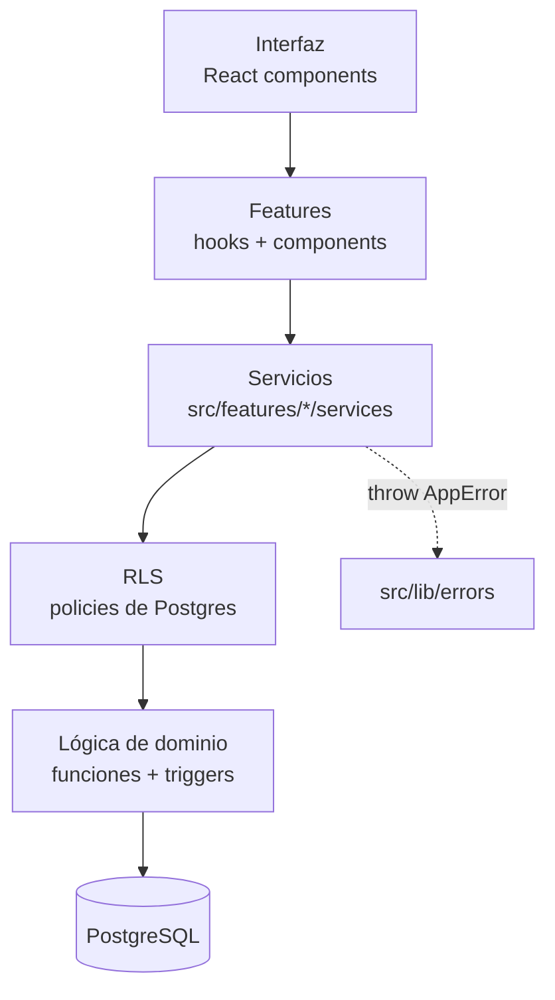
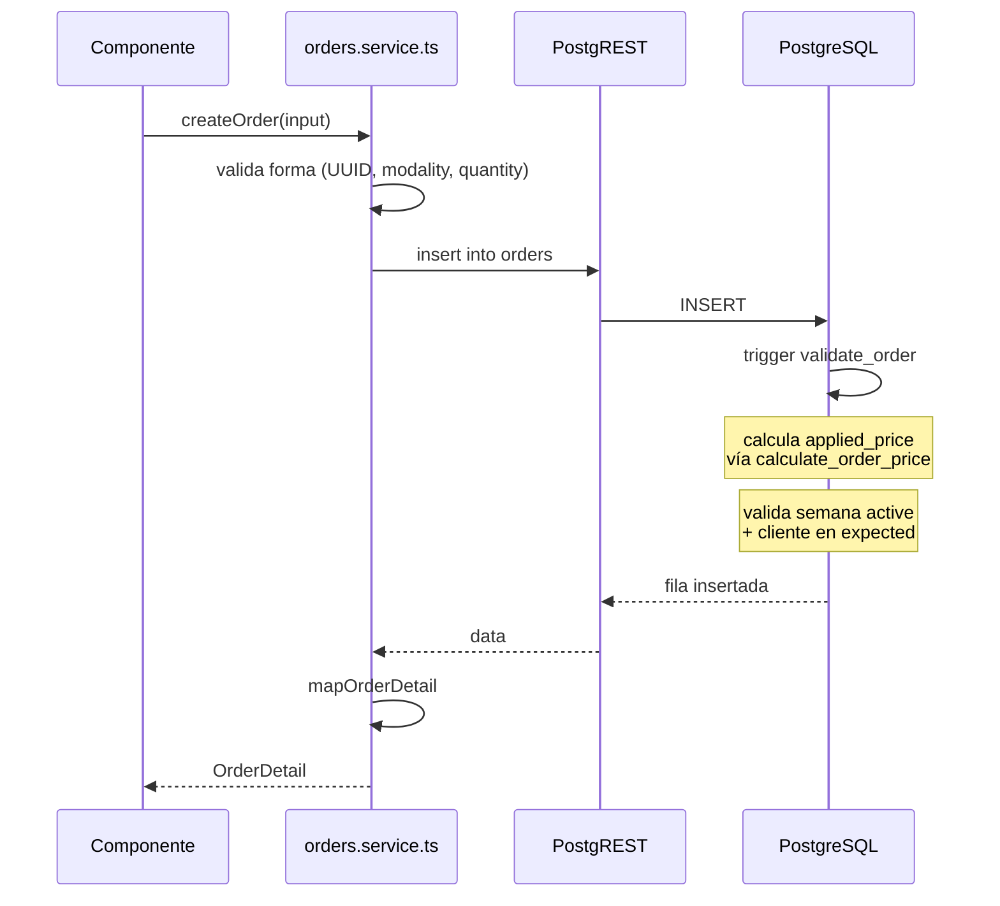
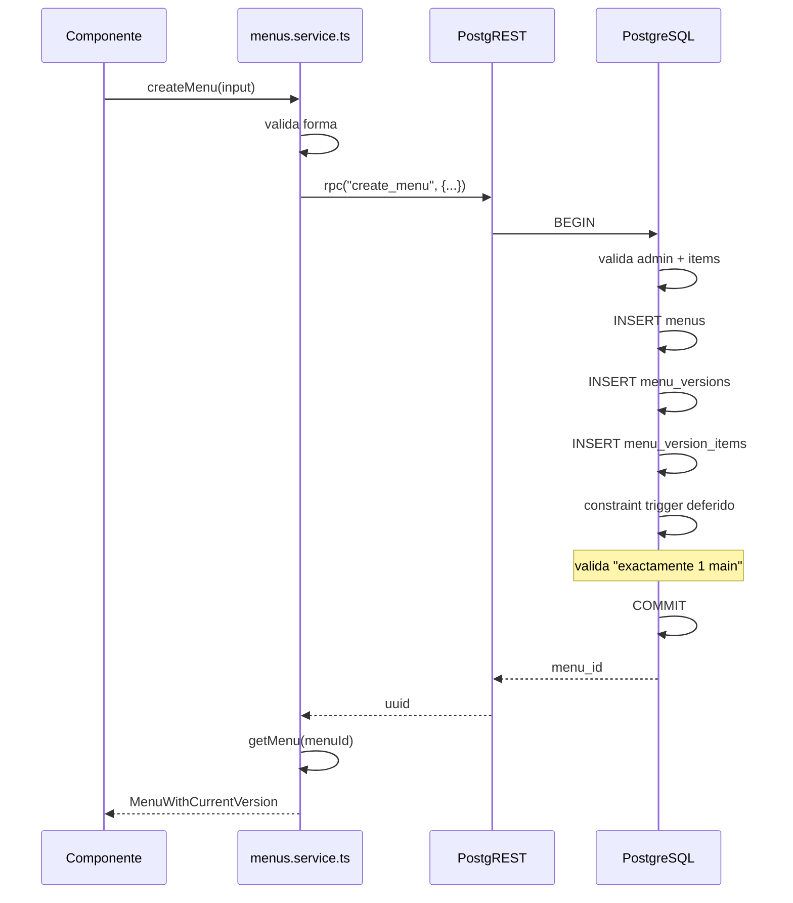
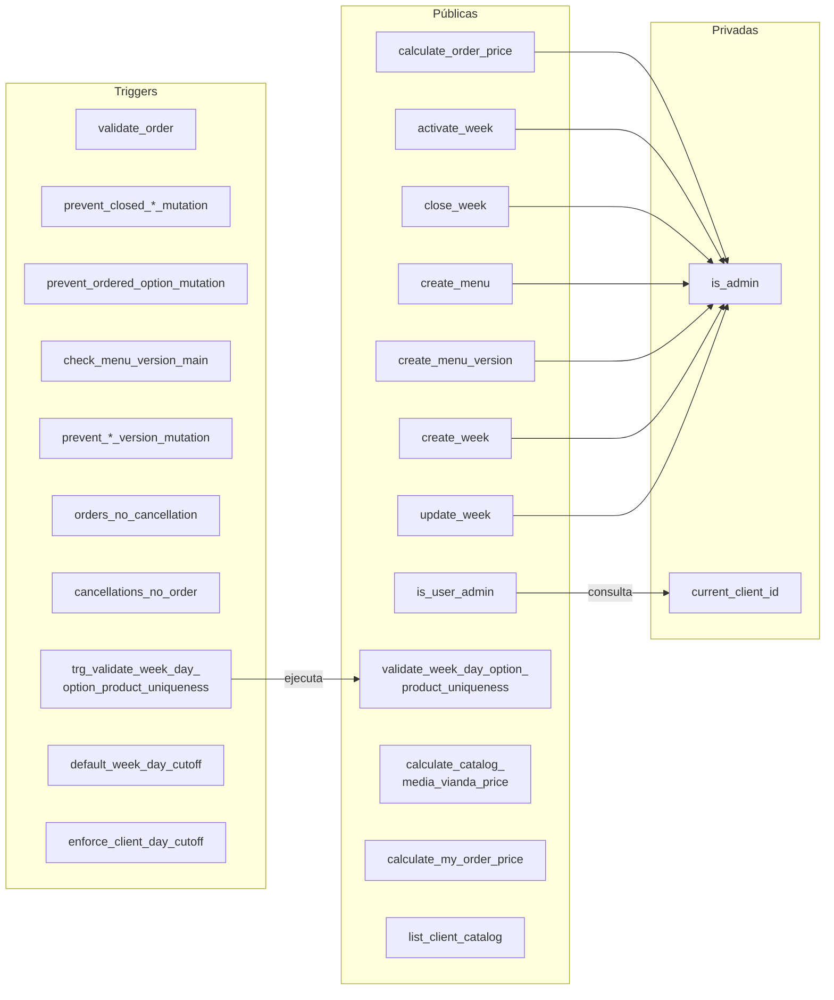
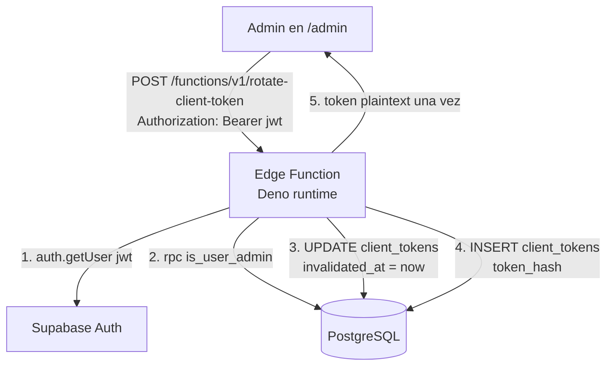
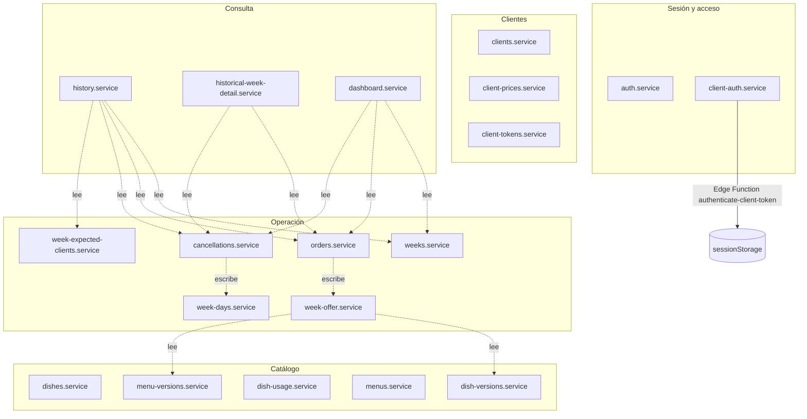

# Arquitectura

## Capas



**Reglas:**

- La UI no conoce Supabase. Solo consume servicios.
- Los servicios encapsulan todas las llamadas a Supabase.
- RLS decide qué filas son visibles y modificables según quién consulta.
- Las funciones de dominio (precio, activación de semana, creación atómica de menús y semanas) viven en PostgreSQL, no en TypeScript.
- Los errores se propagan como `AppError` desde la capa de servicio.

## Separación de responsabilidades

```
¿Dónde va esta lógica?

Regla de negocio crítica
    → PostgreSQL (constraint, función, trigger)

Acceso a datos + validación de forma
    → Service (src/features/*/services)

Estado de UI (loading, saving, error, empty)
    → Hook / componente

Presentación
    → Componente
```

## Los dos consumidores

```mermaid
flowchart LR
    subgraph Admin
        A1[Admin en navegador] --> A2[Supabase Auth<br/>JWT con user_id]
        A2 --> A3[RLS admin]
        A3 --> A4[private.is_admin]
        A4 --> A5[Acceso total<br/>a las 15 tablas]
        A5 -->|POST rotate-client-token| A6[Link personal<br/>token una sola vez]
    end

    subgraph Cliente
        C1[Cliente abre<br/>/menu/:token] -->|POST authenticate-client-token| C2[Edge Function<br/>JWT ES256 por 1 h]
        C2 --> C3[sessionStorage<br/>de la pestaña]
        C3 --> C4[createClientWithToken<br/>JWT con claim client_id]
        C4 --> C5[RLS cliente]
        C5 --> C6[Acceso limitado:<br/>sus datos + oferta active]
        A6 -.->|por WhatsApp, etc.| C1
    end
```



Ambos llegan a las mismas tablas. La diferencia es:

- **Admin:** se autentica con Supabase Auth normal. Sus `auth.uid()` aparece en `private.admin_users`. Las policies le dan `FOR ALL`.
- **Cliente:** no tiene cuenta. Parte de un link personal cuyo token lo canjea la Edge Function `authenticate-client-token` por un JWT (firma **ES256**, claim `client_id`, TTL 1 h). Las policies chequean `private.current_client_id()` para limitar todo a sus propias filas.

### Detalles del JWT de cliente

- Firma con la **signing key** del proyecto (`supabase gen signing-key --algorithm ES256`), **no** con `SUPABASE_JWT_SECRET` (que es HS256 y solo sirve para los tokens de Supabase Auth).
- Secrets: `CLIENT_JWT_PRIVATE_KEY_JWK` + `CLIENT_JWT_KID`.
- **Requisito operativo:** la signing key tiene que estar **activa** en el panel (Auth → Signing Keys) y su pública publicada en el JWKS del proyecto; si no, PostgREST rechaza el JWT con `PGRST301 "No suitable key was found to decode the JWT"`. La JWK privada se importa forzando `key_ops: ["sign"]` (jose le pasa `key_ops` a WebCrypto como _usages_ y una clave privada ECDSA solo admite `sign`). Ver `docs/decisiones/20261001-cliente-jwt-es256-signing-key.md`.
- `verify_jwt = false` en `supabase/config.toml` para `authenticate-client-token`: la llamada llega sin el token de Supabase Auth (el propio link es la credencial).
- El JWT vive en `sessionStorage` de la pestaña, guardado junto al `linkToken` que lo produjo (`todo-artesanal:client-session:v1`). Si el admin rota el link, la sesión vieja se descarta.
- El provider lo renueva 60 s antes de expirar y `ClientMenuPage` usa un `sessionId` monotónico como clave de consulta para evitar parpadeos.
- **Limitación conocida:** rotar el link invalida el token del enlace, pero no revoca un JWT ya emitido (válido hasta 1 h). Revocación inmediata requeriría una denylist en la Edge Function.

## Flujo de una petición de escritura

Ejemplo: admin crea un pedido.



**Puntos clave:**

- El `applied_price` **no lo envía el frontend**. El trigger lo calcula.
- La validación de negocio (semana activa, cliente esperado, etc.) es del trigger, no del servicio.
- El servicio solo valida **forma** (UUID válido, enumeraciones, tipos).
- `modality` la determina la opción elegida (`general`/`opcional`): en
  producción el trigger la **normaliza** (`new.modality := offer_modality`)
  y `media_vianda` se conserva (ver
  `docs/decisiones/20260926-oferta-general-opcional.md`).

## Flujo de una operación atómica multi-tabla

Ejemplo: admin crea un menú con composición.

Sin RPC, la creación de un menú requeriría:

1. INSERT en `menus`.
2. INSERT en `menu_versions`.
3. INSERT en `menu_version_items`.

Si el paso 3 falla, la versión queda huérfana e inmutable (trigger inmutable + FK sin cascade). **No hay rollback posible desde el frontend.**

Por eso se usa un RPC:



**RPCs atómicos en el proyecto:**

| RPC                   | Qué crea                                              |
| --------------------- | ----------------------------------------------------- |
| `create_menu`         | menus + menu_versions + menu_version_items            |
| `create_menu_version` | menu_versions + menu_version_items                    |
| `create_week`         | weeks + 5 week_days                                   |
| `update_week`         | recrea week_days (con cascade sobre week_day_options) |

## Funciones de dominio en PostgreSQL



**Públicas:** invocables desde el frontend (admin) o desde la Edge Function.
**Privadas:** solo invocables por RLS policies o por otras funciones.
**Triggers:** corren automáticamente en INSERT/UPDATE/DELETE.
**`validate_week_day_option_product_uniqueness`** es security definer pero no está pensada para invocarse desde el frontend: la llama su trigger (unicidad de producto por semana, con advisory lock).

## Edge Functions

### `rotate-client-token` (admin → link)



**Seguridad:**

- Requiere JWT de admin.
- Verifica admin contra `private.admin_users` vía RPC público.
- Usa `service_role` internamente para escribir en `client_tokens` (que no tiene policy de cliente).
- Devuelve el token en texto plano **una única vez**. Nunca se persiste en frontend.

### `authenticate-client-token` (link → JWT)

```mermaid
flowchart TD
    B[Cliente en /menu/:token] -->|POST /functions/v1/authenticate-client-token<br/>body: { token }| EF2[Edge Function<br/>verify_jwt = false]
    EF2 -->|1. sha256(token)| DB2[(PostgreSQL)]
    EF2 -->|2. valido y no vencido?| DB2
    EF2 -->|3. firma ES256<br/>sub = client_id, ttl 1h| K[Signing key +<br/>CLIENT_JWT_PRIVATE_KEY_JWK / _KID]
    EF2 -->|4. { accessToken, clientId, expiresIn }| B
```

**Seguridad:**

- `verify_jwt = false`: la credencial es el token del link, no el de Supabase Auth.
- Nunca recibe ni devuelve datos del cliente más allá de `clientId`.
- El enlace de `client_tokens` se valida por hash (SHA-256), igual que en `rotate-client-token`.

## Diagrama de features



No todas las features tienen servicio: `dashboard` y `menu` orquestan
servicios de otras features en lugar de tocar Supabase en forma directa.

## Patrón de carga de datos en la UI

El estado de carga/error de los listados se **deriva en el render**, no se sincroniza dentro de un efecto (regla `react-hooks/set-state-in-effect`: el cuerpo de un efecto solo puede fijar estado dentro de callbacks).

- **Listados con filtros y paginación** (Clientes, Menús, Platos, Semanas, Pedidos, Cancelaciones, Historial):
  - El efecto dispara la consulta del servicio y guarda el resultado **dentro de sus callbacks**, junto a la clave de la consulta que lo pidió: `result = { key, items, total }` con `key = \`${page}|${filtroA}|${filtroB}|${reloadToken}\``.
  - El resto se deriva: `loading = result?.key !== requestKey`, `items = result?.key === requestKey ? result.items : []`, `error = failure?.key === requestKey ? failure.message : null`.
  - Beneficio: nunca se muestra el listado de un filtro o página anteriores y el spinner aparece sin fijar estado antes del `await`.
  - Los refrescos con los mismos filtros (reintentar, después de crear o borrar) incrementan `reloadToken` con `reload()`; no se llama al loader desde un evento.
  - Las actualizaciones locales del listado (después de guardar en el drawer) se aplican con un patch que respeta la clave vigente.
  - El cleanup del efecto marca `cancelled` para descartar respuestas de consultas ya reemplazadas.
- **Drawers**: el formulario se reinicia por **remonte**. La página dueña le pasa `key` (`"create"`, `edit:${id}` o `"closed"`) y el drawer inicializa `loading` en `useState(...)` según el modo.
- **Estado dependiente de un id**: los días de una semana se guardan junto al `weekId` al que pertenecen (y la selección del día junto a la semana en la que se eligió) para derivarlos al renderizar, en lugar de limpiarlos dentro de un efecto.
- **Sesión del cliente (`ClientSessionProvider`)**: el canje de link → JWT corre en un efecto que solo fija estado dentro de callbacks (`then/catch/finally`); un guard de intentos con `ref` evita canjes repetidos; la renovación 60 s antes de expirar es un timer en background que **no** cambia el estado visible (evita el parpadeo del spinner), y `reauthenticate()` es la vía para que un botón dispare una recarga por cambio de estado. La clave de la query del listado es el `sessionId` monótono, no el token.

## Pendientes de arquitectura

- **UI de cliente en `/menu/:token` (hecha):** sesión, oferta de la semana activa (`getWeekOffer`/`listDayOptions` ya aceptan un cliente Supabase propio), pedidos y cancelaciones por día (`createOrder`/`updateOrder`/`deleteOrder`, `createCancellation`/`deleteCancellation`) y precio efectivo vía el RPC `calculate_my_order_price`. La media vianda **desde el catálogo** también está implementada: el RLS de cliente no expone `dishes`/`menus`, así que el catálogo entra por el RPC `list_client_catalog` (`security definer`, `20261001000002_client_catalog.sql`), que consume `ClientCatalogPicker`. El "fuera de horario" está implementado con corte por día (`week_days.cutoff_at`, decisión `20261001`): banner + acciones deshabilitadas en `ClientDayCard`, editor por día en `WeekWorkspace`.
- **Reconciliación de migraciones:** el historial local y remoto divergía (4 migraciones solo en local, 4 solo en remoto). **Decisión: gana el repo local.** Hecho el 2026-09-27: las 4 remotas se inspeccionaron (contenido equivalente a archivos locales) y se marcaron `reverted`; la consolidación `20260927000001` fija el estado final. **Resuelto (2026-09-29):** se corrió `npx supabase db push --include-all` y local y remoto quedaron en sync (se sumaron `20260929000001` y `20260929000002`). Ver `docs/decisiones/20260927-local-fuente-de-verdad.md`.
- **Realtime:** Supabase Realtime no se usa: la UI de cliente ya existe
  (`/menu/:token`) y refresca por `reload()` (incluido el auto-`reload()`
  al llegar cada corte de horario). Si algún día hace falta push real,
  definir qué tablas se suscriben.
- **Vistas o RPC de reportes:** varios servicios calculan agregados en cliente (dish-usage, order totals, historical weeks, dashboard). Migrar a vistas o RPC si el volumen crece.
- **Revocación inmediata de JWT:** hoy un JWT emitido sigue válido hasta 1 h aunque el admin rote el link.
