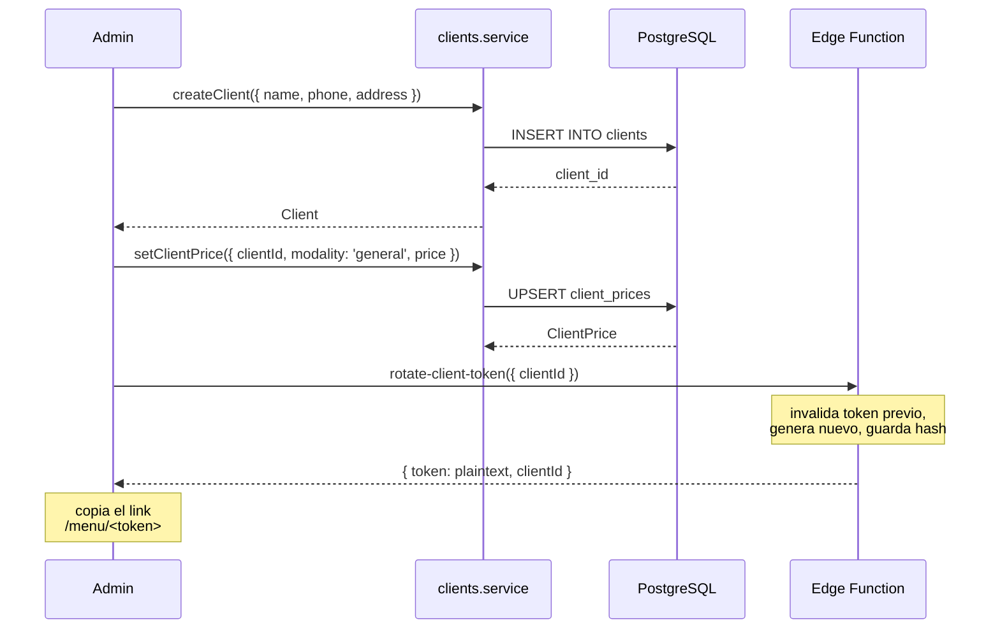
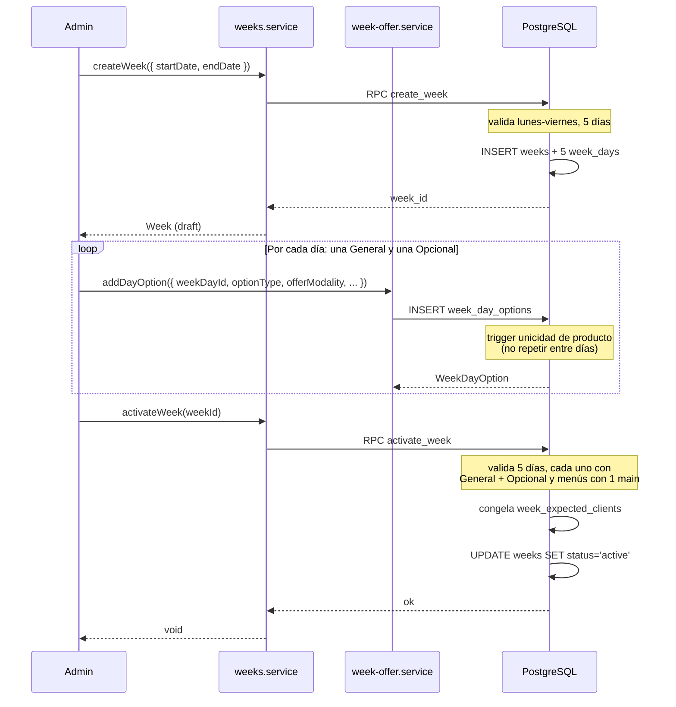
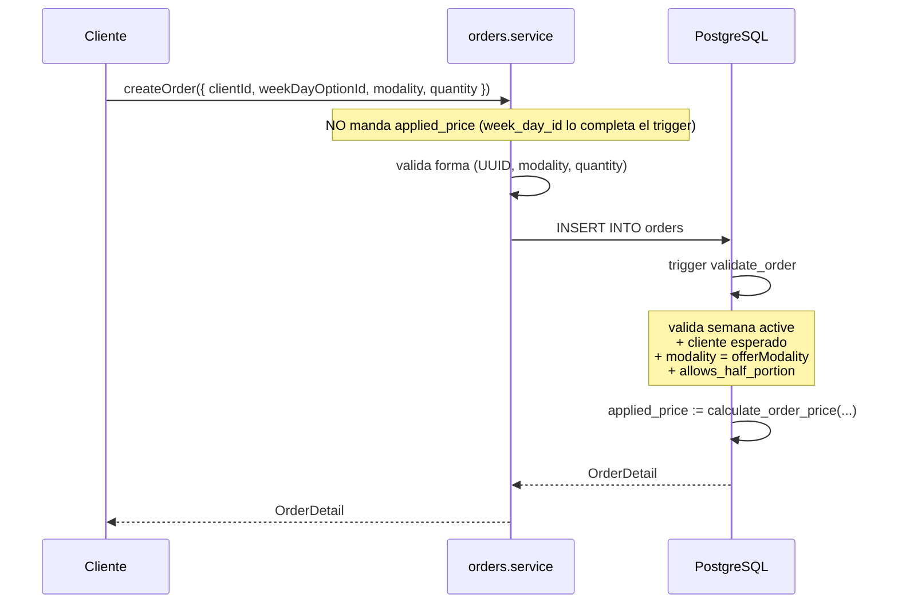
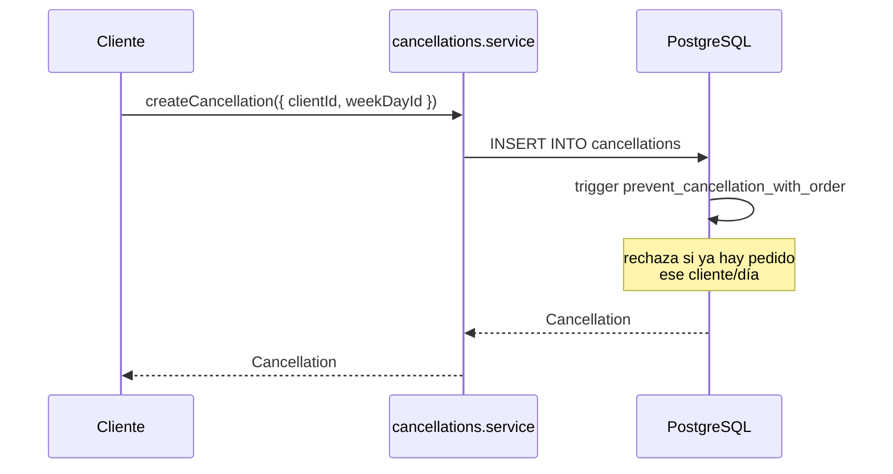
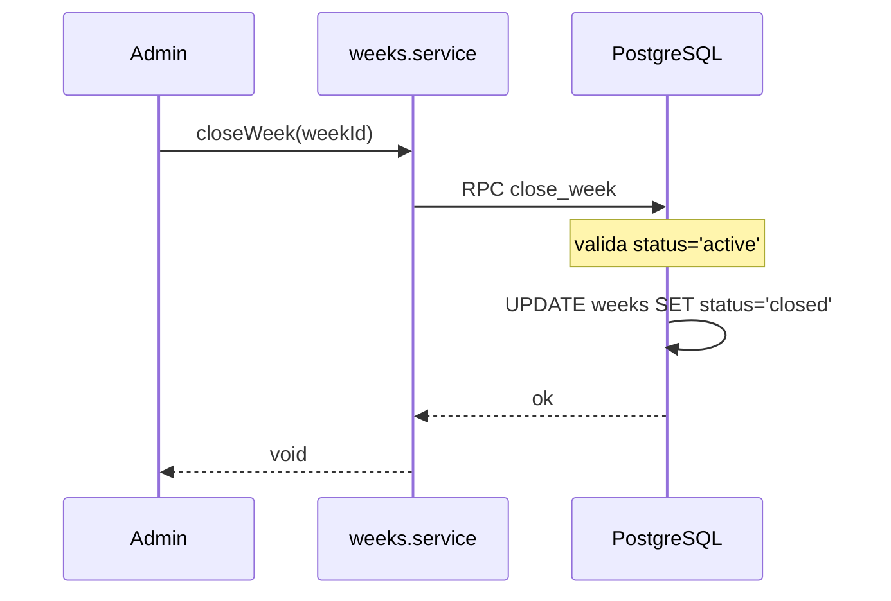
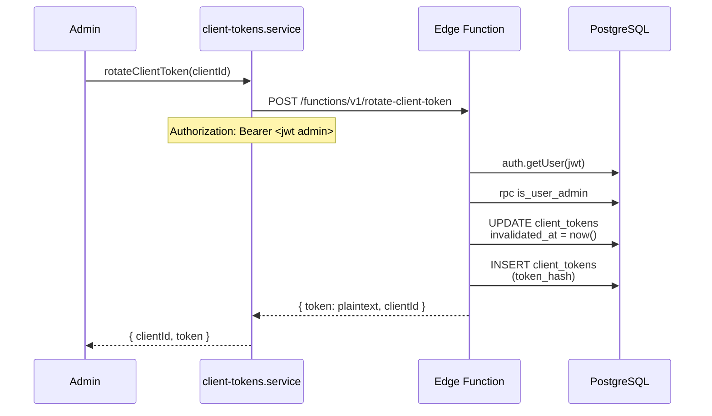
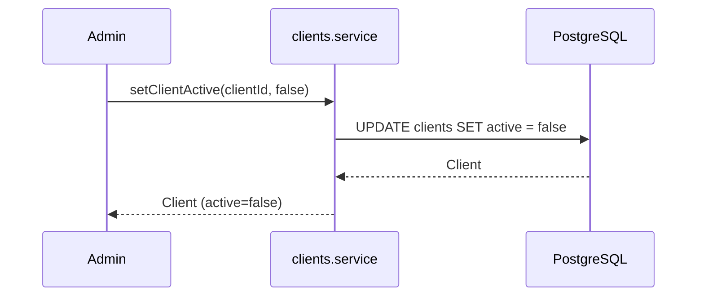
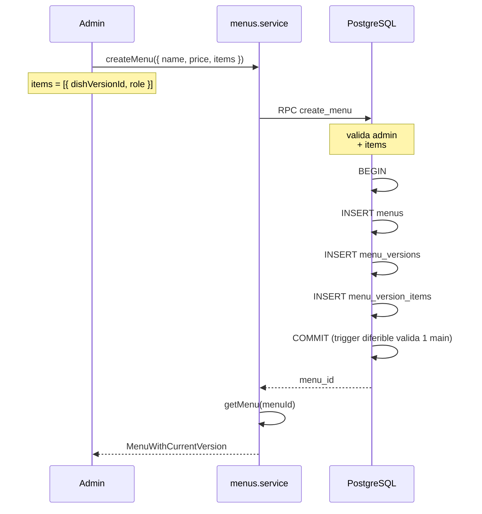
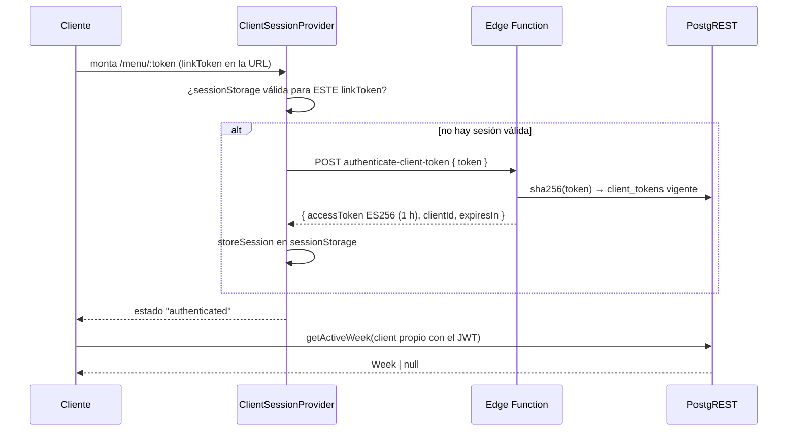

# Flujos operativos

Secuencia de las operaciones típicas de Todo Artesanal.

Cada flujo indica: quién actúa, qué servicios se invocan, qué reglas
de negocio se aplican, y qué invariantes están en juego.

## Índice

1. [Onboarding de un cliente](#1-onboarding-de-un-cliente)
2. [Crear y activar una semana](#2-crear-y-activar-una-semana)
3. [Cliente pide una vianda](#3-cliente-pide-una-vianda)
4. [Cliente pide media vianda](#4-cliente-pide-media-vianda)
5. [Cliente cancela un día](#5-cliente-cancela-un-día)
6. [Admin cierra la semana](#6-admin-cierra-la-semana)
7. [Ver quién no respondió](#7-ver-quién-no-respondió)
8. [Rotar el token de un cliente](#8-rotar-el-token-de-un-cliente)
9. [Dar de baja a un cliente](#9-dar-de-baja-a-un-cliente)
10. [Crear un plato con su primera versión](#10-crear-un-plato-con-su-primera-versión)
11. [Crear un menú compuesto](#11-crear-un-menú-compuesto)
12. [Modificar el precio de un plato](#12-modificar-el-precio-de-un-plato)
13. [Cliente abre su enlace](#13-cliente-abre-su-enlace)

---

## 1. Onboarding de un cliente

**Actor:** admin.

**Objetivo:** dar de alta un cliente y generarle su link personal.



**Pasos:**

1. Crear el cliente con `createClient`.
2. Opcional: cargar precios especiales con `setClientPrice` y/o
   `setClientProductPrice`.
3. Generar el link personal con `rotateClientToken`. **El token
   plaintext se muestra una única vez**. El admin lo copia y lo manda
   al cliente (WhatsApp, email, etc.).
4. Cuando el cliente abre el link, el token se canjea por un JWT de 1 h
   (flujo #13). Rotar el link después invalida el enlace, pero no un JWT
   ya emitido.

**Invariantes:**

- El token se almacena hasheado.
- Como máximo un token vigente por cliente.
- El plaintext solo se devuelve en la respuesta de la rotación.

---

## 2. Crear y activar una semana

**Actor:** admin.

**Objetivo:** configurar la oferta de una semana y activarla.



**UI (admin):** la creación/edición de la semana es un **taller inline**
en `/admin/semanas` (`WeekWorkspace`), no un drawer: las fechas y el grid
de oferta (5 columnas, una por día) aparecen dentro de la misma página. El
drawer (`WeekDetailDrawer`) solo muestra una semana en modo lectura y
ofrece "Abrir en la página". El taller incluye **"Sugerir opciones"** por
día y **"Sugerir semana"**: completan los slots vacíos con platos del
catálogo evitando repetir producto dentro de la semana y respetando
General + Opcional.

**Pasos:**

1. `createWeek` con lunes y viernes. El RPC crea la semana y sus 5 días.
2. Para cada día: agregar **dos** opciones con `addDayOption`, una con
   `offerModality: 'general'` y otra con `'opcional'`. Cada opción es un
   plato o un menú. El mismo plato/menú no puede repetirse en otro día
   de la misma semana.
3. `activateWeek`. El RPC valida:

   - 5 días presentes.
   - **Cada día con una opción General y una opción Opcional.**
   - Cada menú usado con exactamente 1 main.
   - No hay otra semana activa.

   Y luego congela la población esperada (`week_expected_clients`).

**Invariantes:**

- #6: la semana no pertenece a un cliente.
- #14: la oferta es común.
- Solo una semana activa a la vez.
- Un producto no se repite entre días de la misma semana.

**Errores típicos:**

- `23P01` (CONFLICT): rango se superpone con otra semana.
- `BUSINESS_RULE`: validaciones de activate fallan (día sin General u
  Opcional, menú sin main, etc.).
- `BUSINESS_RULE`: "ya está utilizado en otro día de esta semana"
  (trigger de unicidad — aplicado en local y en remoto desde el push del
  2026-09-29).

---

## 3. Cliente pide una vianda

**Actor:** cliente (con JWT de `client_id`).

**Objetivo:** registrar un pedido para un día de la semana activa.



**Pasos:**

1. El cliente ve la oferta activa (`getWeekOffer` sobre la semana activa;
   RLS limita a `weeks.active`).
2. Elige una opción. **La modalidad no es libre**: si elige la opción
   General del día, el pedido es `general`; si elige la Opcional, es
   `opcional`. Solo puede sumar `media_vianda` (flujo #4) si el cliente
   tiene `allows_half_portion`.
3. `createOrder({ clientId, weekDayOptionId, modality, quantity })`.
   **No envía `applied_price` ni `week_day_id`**: el trigger los resuelve
   (el día, a partir de la opción).
4. El trigger `validate_order`:

   - Verifica que la opción exista y que su semana esté `active`.
   - Verifica que el cliente esté en `week_expected_clients`.
   - Verifica que `modality` coincida con el `offerModality` de la
     opción y la **normaliza** si no (igual en local y en producción;
     sin efecto práctico porque la UI manda la modalidad de la opción).
   - Calcula `applied_price` con `calculate_order_price`.
   - Congela el precio en la fila.

**Invariantes:**

- #3: el pedido conserva su precio aplicado.
- #4: cambios futuros de precios no lo modifican.

**Restricciones:**

- Un cliente no puede tener dos pedidos idénticos. Para más cantidad:
  `quantity`.
- No puede haber pedido y cancelación el mismo día.

---

## 4. Cliente pide media vianda

**Actor:** cliente.

**Precondición:** `clients.allows_half_portion = true`.

**Objetivo:** pedir la mitad de una vianda.

**Pasos:**

1. El cliente marca el pedido como `modality = 'media_vianda'`. La fuente
   del producto puede ser:
   - **la oferta del día**: elige una de las opciones (General u
     Opcional) del día, como en el flujo #3 → `week_day_option_id`, o
   - **el catálogo**: elige **cualquier plato o menú activo**, aunque no
     esté en la oferta de ese día → `dish_version_id` /
     `menu_version_id` (el pedido igual queda atado a un día vía
     `week_day_id`).
2. El trigger `validate_order` valida `allows_half_portion` y el día.
3. El precio se congela en `applied_price`:

   - **desde la oferta**: `calculate_order_price(..., 'media_vianda')`
     (precio normal aplicable por la rama `general`, nunca `opcional`,
     dividido por 2);
   - **desde el catálogo**: `calculate_catalog_media_vianda_price(...)`
     (plato: específico > general > base; menú: general > base; siempre
     la mitad).

**Ejemplo:**

```
Milanesa base_price       = $8.000
Cliente precio específico = $6.000  (por plato)
  → normal = $6.000
  → media_vianda = $3.000
```

**Invariantes:**

- La media vianda NO es una categoría de plato.
- Requiere `allows_half_portion`.
- Tiene **dos fuentes de producto**: la oferta del día o el catálogo
  (`docs/decisiones/20260929-media-vianda-catalogo.md`).
- El pedido siempre pertenece a un día (`orders.week_day_id`).

---

## 5. Cliente cancela un día

**Actor:** cliente.

**Objetivo:** indicar que no va a recibir vianda un día.



**Pasos:**

1. `createCancellation` con `{ clientId, weekDayId }`.
2. El trigger verifica que no exista un pedido del mismo cliente y día.

**Invariantes:**

- #12: las cancelaciones conservan su contexto histórico.
- Cancelar = responder.
- Afecta al día completo (no a una modalidad).

**Restricciones:**

- UNIQUE `(client_id, week_day_id)`.
- Si la semana está `closed`, el trigger lo rechaza.

---

## 6. Admin cierra la semana

**Actor:** admin.

**Objetivo:** dar por terminado el período operativo.



**Pasos:**

1. `closeWeek`. El RPC `close_week` verifica que la semana esté en
   `active`.
2. Pasa a `closed`. **Terminal.**

**Efecto:**

- Todos los datos asociados (week_days, week_day_options, orders,
  cancellations) quedan protegidos por los triggers
  `prevent_closed_*_mutation`.
- Cualquier intento de modificación falla con `BUSINESS_RULE`.

**Invariantes:**

- #11: las operaciones no permitidas para una semana cerrada no pueden
  ejecutarse manipulando el frontend.

---

## 7. Ver quién no respondió

**Actor:** admin.

**Objetivo:** saber qué clientes esperados no registraron ni pedido ni
cancelación.

**Pasos:**

1. `getUnansweredClients(weekId)`.
2. El servicio:

   - Consulta `week_expected_clients` (población congelada).
   - Consulta `orders` y `cancellations` de la semana.
   - Resta: quien está en la población y no está en ninguno de los dos
     conjuntos.

**Invariante crítica:**

- #13: el cálculo se hace contra `week_expected_clients`, **no** contra
  `clients.active` actual.

**Ejemplo:**

```
Semana 10 (cerrada)
├── Esperados: [A, B, C, D]
├── Con pedido: A
├── Con cancelación: B
└── Sin responder: C, D
```

Aunque C o D estén desactivados hoy, la semana 10 sigue mostrándolos
como "sin responder". El estado histórico se conserva.

---

## 8. Rotar el token de un cliente

**Actor:** admin.

**Objetivo:** invalidar el link personal actual y generar uno nuevo.



**Pasos:**

1. `rotateClientToken(clientId)`.
2. La Edge Function:

   - Verifica que el caller sea admin.
   - Invalida el token vigente actual.
   - Genera 32 bytes random (base64url).
   - Guarda SHA-256.
   - Devuelve el plaintext.

**Invariantes:**

- #7: rotar un token invalida el anterior.
- Máximo un token vigente por cliente.
- El token nunca se almacena en plaintext.

**Limitación conocida:**

- Rotar invalida el **enlace**, no un JWT ya emitido con él: ese JWT
  sigue válido hasta 1 h. Si hace falta revocación inmediata, hay que
  agregar una denylist en `authenticate-client-token`.
- En la pestaña del cliente, la sesión guardada queda inservible sola:
  `readStoredSession` compara el `linkToken` guardado y devuelve `null`
  si no coincide con el de la URL.

**Cuándo se rota:**

- El link se filtró por error.
- El cliente perdió el link.
- Auditoría.

---

## 9. Dar de baja a un cliente

**Actor:** admin.

**Objetivo:** dejar de incluir un cliente en futuras semanas.

**Decisión:** **desactivar, no borrar.**



**Por qué no `deleteClient`:**

- Un cliente con historial tiene FKs que lo referencian (orders,
  cancellations).
- El `DELETE` falla con FK violation.
- Aunque no fallara, borrarlo eliminaría historia.

**Excepción: borrado definitivo solo sin historial:**

La ficha de cliente incluye un botón "Eliminar definitivamente" (con
confirmación de advertencia) que llama a `deleteClient`. Solo tiene éxito
si el cliente no tiene pedidos, cancelaciones ni semanas que lo
referencien; si los tiene, la DB responde con FK violation (23503) y la
UI muestra el mensaje "usá Desactivar". Como la historia —si existe—
impide el DELETE, el borrado nunca puede borrar hechos pasados.

**Efecto de desactivar:**

- El cliente sigue existiendo con su historial intacto.
- No va a ser incluido en `week_expected_clients` de futuras
  activaciones.
- Las semanas pasadas siguen reconociéndolo como parte de su población.

**Invariantes:**

- #5: desactivar no elimina historial.
- #15: los hechos pasados no se reinterpretan.

---

## 10. Crear un plato con su primera versión

**Actor:** admin.

**Objetivo:** agregar un plato nuevo al catálogo.

**Pasos:**

1. `createDish({ name, price, category?, climate? })`.
2. El servicio:

   - INSERT en `dishes` (identidad).
   - INSERT en `dish_versions` (v1 con name y price).
   - Si el segundo falla: rollback manual (borra la identidad huérfana).

**Nota:** este flujo es la excepción donde se usa rollback manual en
lugar de un RPC. Es viable porque `dishes` no tiene trigger inmutable.
Ver `docs/servicios.md` para el TODO de migrar a RPC.

**Invariante:**

- Cada edición de nombre o precio = nueva versión.

---

## 11. Crear un menú compuesto

**Actor:** admin.

**Objetivo:** crear un menú con su composición.



**Pasos:**

1. `createMenu` con `{ name, price, items }`.
2. El RPC valida:

   - Al menos 1 item.
   - Exactamente 1 con `role='main'`.
   - Sin `dish_version_id` duplicados.
   - Cada `dish_version_id` existe.

3. Inserta en una transacción real. El trigger diferible
   `menu_version_items_require_main` valida "exactamente 1 main" al
   COMMIT.

**Por qué RPC:** sin él, si falla el INSERT de items, la versión queda
huérfana e inmutable (trigger + FK sin cascade). No hay rollback desde
TS.

---

## 12. Modificar el precio de un plato

**Actor:** admin.

**Objetivo:** cambiar el precio base de un plato existente.

**Importante:** esto **no** modifica el precio de platos ya pedidos en
semanas pasadas. Cada pedido conserva su `applied_price`.

**Pasos:**

1. `createDishVersion(dishId, { name, price })`.
2. El servicio calcula `MAX(version_number) + 1` y crea una versión nueva.
3. La versión anterior sigue existiendo, inmutable.
4. Las semanas futuras que referencien el plato van a usar la versión
   nueva (cuando el admin cargue la oferta).

**Ejemplo:**

```
Milanesa
├── v1 ($5.000)  ← usada en Semana 10
└── v2 ($6.000)  ← usada en Semana 11
```

**Invariantes:**

- #3: el pedido de la Semana 10 conserva $5.000.
- #4: cambiar a $6.000 no lo afecta.
- #15: la Semana 10 no se reinterpreta con el precio nuevo.

---

## 13. Cliente abre su enlace

**Actor:** cliente (sin cuenta, con su link `/menu/:token`).

**Objetivo:** resolver la sesión y mostrar la semana activa.



**Pasos:**

1. Al montar, el provider valida el formato del `linkToken`
   (`LINK_TOKEN_PATTERN`) y mira `sessionStorage`.
2. Si no hay sesión o no corresponde a ese `linkToken`, canjea el token
   por un JWT con `authenticateClientToken`.
3. Guarda `{ linkToken, accessToken, clientId, expiresAt }` y expone la
   sesión por contexto (`ClientSessionProvider`).
4. `useClientWeekData` carga, con **un cliente Supabase propio**
   (`createClientWithToken`), la semana activa, su oferta, los pedidos y
   cancelaciones del cliente y sus precios efectivos (RPC
   `calculate_my_order_price`), usando `sessionId` + `reloadToken` como
   clave de la query.
5. `ClientDayCard` permite pedir, cambiar cantidad/notas, quitar el pedido
   y avisar que no se quiere ese día (cancelación). Cada cambio dispara
   `reload()`.
6. En segundo plano renueva el JWT 60 s antes de expirar, sin cambiar el
   estado visible.

**Estados que maneja la página:**

| Estado                    | Cuándo                                                                        |
| ------------------------- | ----------------------------------------------------------------------------- |
| Autenticando              | Resolviendo el canje o la sesión guardada.                                    |
| Link inválido / rotado    | `AppError("UNAUTHORIZED")` (formato malo, token desconocido o vencido).       |
| Error de red / servidor   | Falló la llamada a la Edge Function. Botón "Reintentar" → `reauthenticate()`. |
| Cargando semana           | Sesión ok, pendiente la carga de oferta + pedidos.                            |
| Sin semana activa         | `getActiveWeek` devuelve `null`.                                              |
| Error de consulta         | Falló la carga de la semana. Botón "Reintentar" → `reauthenticate()`.         |
| Semana cerrada / borrador | La semana activa no existe o está `closed`.                                   |

**Invariantes:**

- La sesión se guarda junto al `linkToken` que la produjo (el mismo que
  ya está en la URL de la pestaña): no se almacena ningún secreto nuevo,
  solo el JWT de corta vida y su vencimiento.
- La sesión es por pestaña (`sessionStorage`): cerrar la pestaña la borra.
- Rotar el link invalida la sesión guardada (comparación de `linkToken`).

---

## Resumen de invariantes por flujo

| Flujo                     | Invariantes                              |
| ------------------------- | ---------------------------------------- |
| Onboarding                | Token hasheado, 1 vigente por cliente    |
| Crear y activar semana    | #6, #14, semana única active             |
| Cliente pide              | #3, #4                                   |
| Cliente pide media vianda | Media vianda = modalidad, no categoría   |
| Cliente cancela           | #12, cancelar = responder                |
| Admin cierra              | #11                                      |
| Ver sin responder         | #13                                      |
| Rotar token               | #7                                       |
| Dar de baja               | #5, #15                                  |
| Crear plato               | Nueva versión = nueva edición            |
| Crear menú                | 1 main + 0..N side                       |
| Modificar precio          | #3, #4, #15                              |
| Cliente abre su enlace    | Sesión por pestaña, JWT 1 h, RLS cliente |
